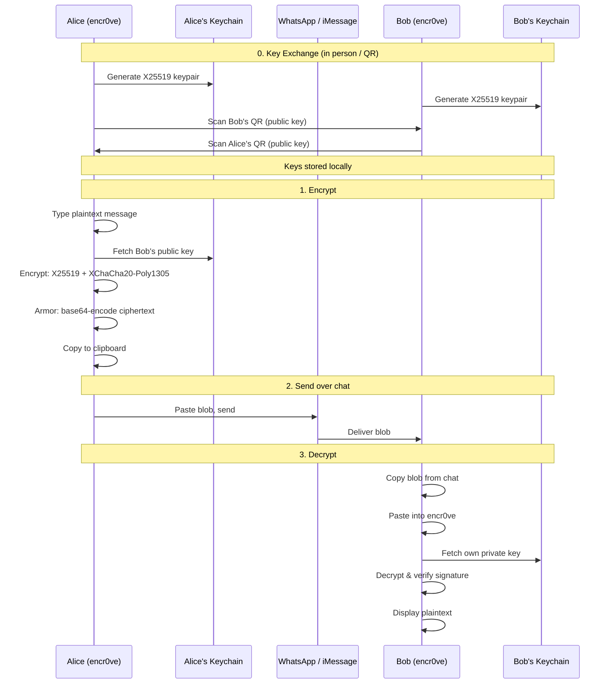
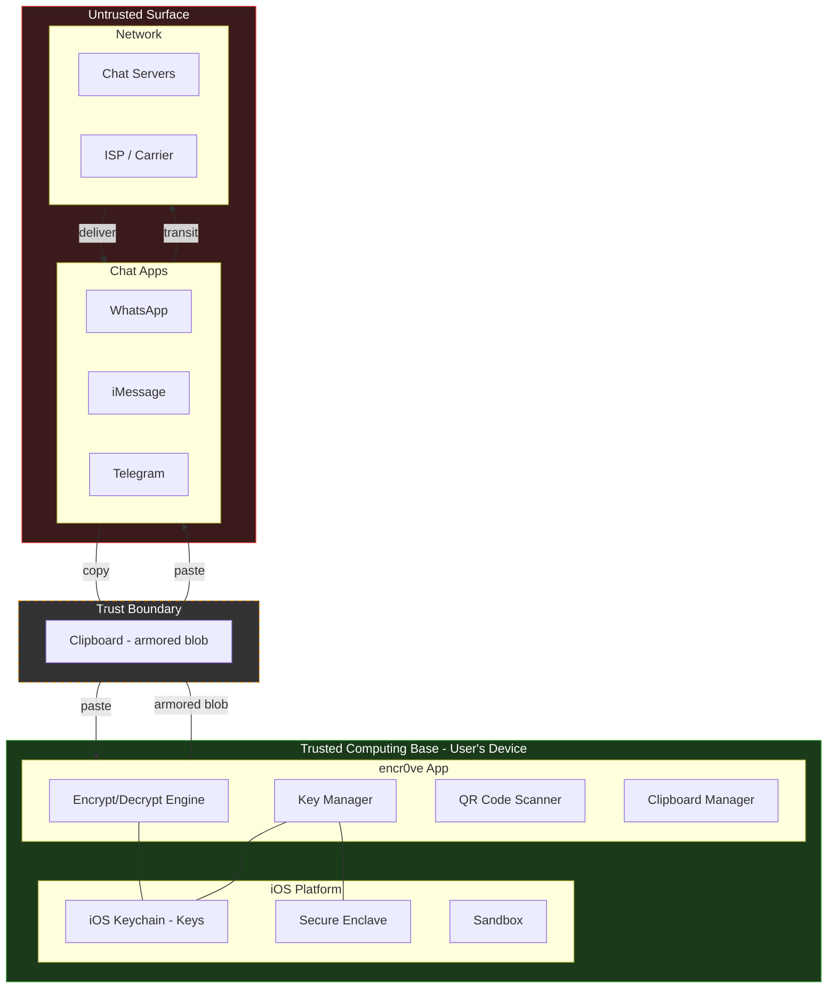
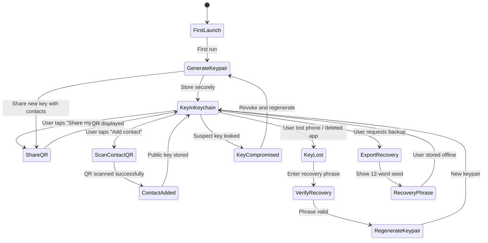
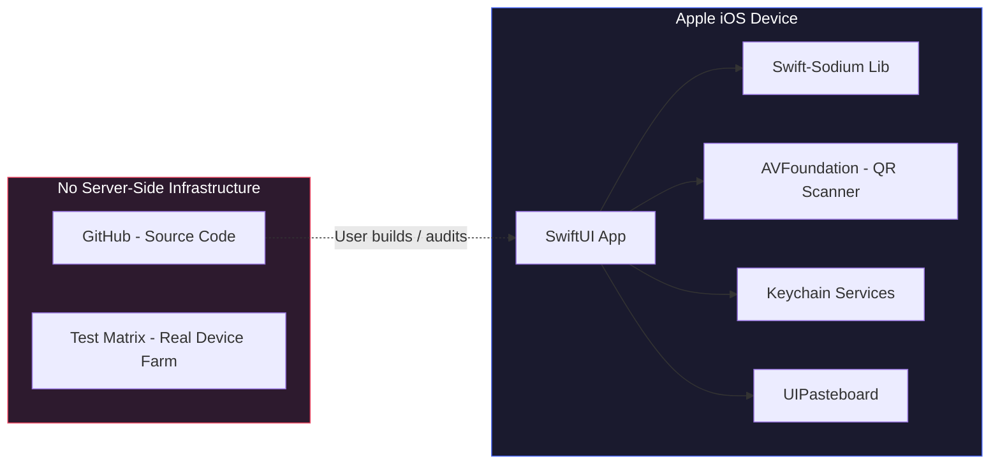
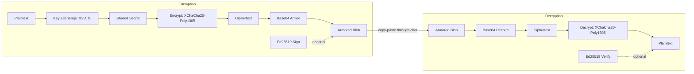

# Encr0ve — Diagrams

## 1. Message Flow (Sequence Diagram)

---

## 2. Trust Boundary Diagram

---

## 3. Key Management Lifecycle

---

## 4. Deployment / System Architecture

---

## 5. Encryption & Decryption Flow

